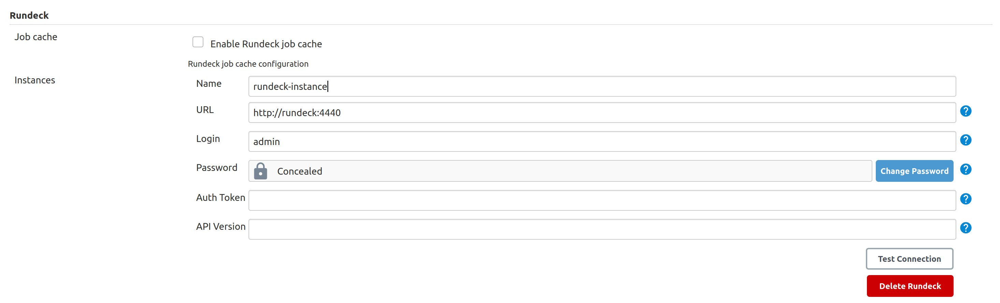
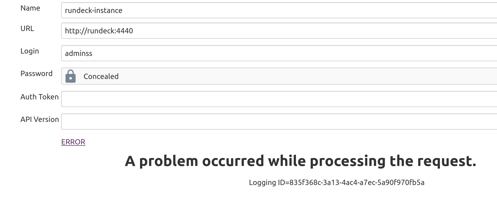
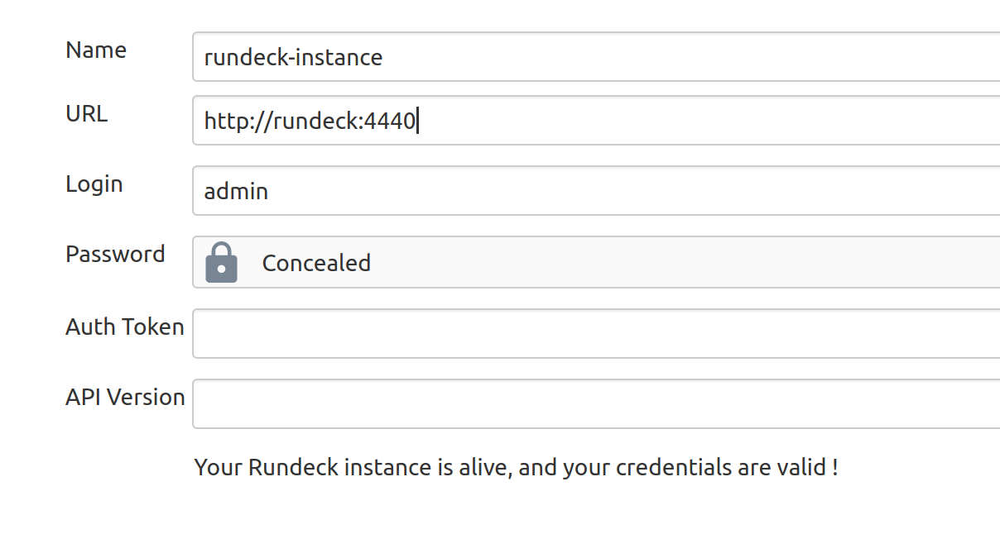
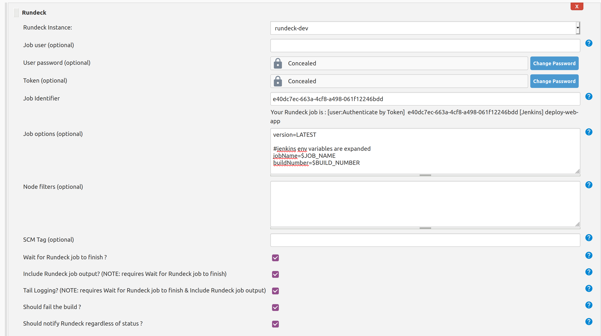
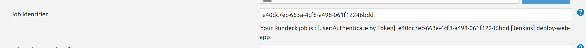
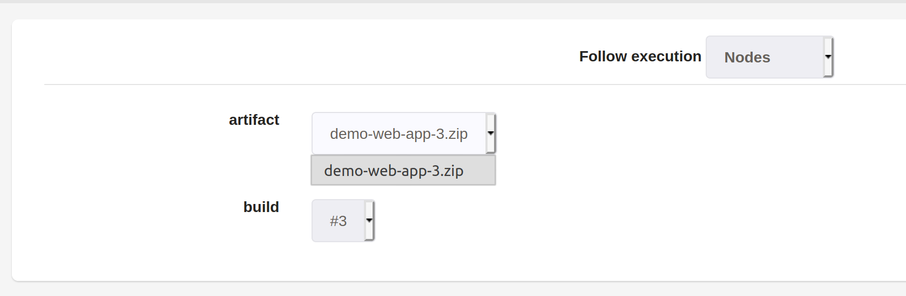
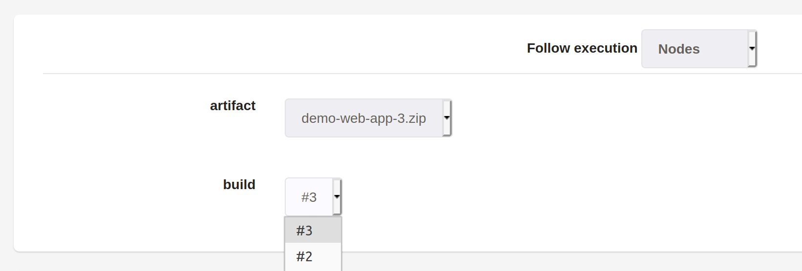

# Jenkins Rundeck plugin

This plugin is a Notifier that will talk to a
[RunDeck](http://www.rundeck.org/) instance (via its HTTP API) to
schedule a job execution on RunDeck after a successful build on
Jenkins.  
It is also a Trigger that will schedule a build on Jenkins after a job
execution on RunDeck (using RunDeck WebHook Notification).  
In addition, it turns Jenkins into an [Option
provider](https://docs.rundeck.com/docs/tutorials/option-provider.html)
for RunDeck, if you want to use your Jenkins build artifacts as an
option to a RunDeck job.

**Table of Contents**

## Use

[RunDeck](https://www.rundeck.com/open-source) is an open-source tool for automating
tasks on multiple nodes, with both a CLI and a web-based interface. You
can use it to deploy your application to multiple nodes/appserv easily.
It has a concept of jobs and build similar to Jenkins.

You have 3 ways to use this plugin :

-   build a "**deployment pipeline**", (the "0-click deployment
    process") : you commit a change, Jenkins picks it up, build, test
    and so on, and then triggers a job execution on RunDeck for
    deploying your application. This requires some configuration on
    Jenkins (both global configuration and job configuration), to link a
    Jenkins job with a RunDeck job.
-   continue your pipeline after the deployment : RunDeck deploys your
    application, then triggers a build on Jenkins to run some
    integration tests (Selenium ?). This requires some configuration on
    RunDeck (WebHook notification) and on Jenkins (Trigger
    configuration, and optionally filter the notifications from
    RunDeck).
-   use Jenkins as an [**Option
    provider**](https://docs.rundeck.com/docs/tutorials/option-provider.html)
    for RunDeck : when you execute a RunDeck job, you can have an
    (input) option, whose values could be retrieve from an external
    system (here, Jenkins). So you can have a RunDeck-job that use a
    Jenkins-artifact (from a Jenkins-build) as an input.

Note that you can combine those use-cases.

### Deployment Pipeline

The goal is to have a **0-click deployment process** : you commit a
change, Jenkins picks it up, build, test and so on, and then triggers a
job execution on RunDeck for deploying your application.  
You can also have an "on-demand" process : configure a "tag" in the job
configuration (see below), and the plugin will only notify RunDeck if
the tag is present in the SCM changelog (= in the commit message).

#### Configuration

First, you need to configure your RunDeck instance on the main Jenkins
configuration page :  

As of Rundeck plugin version 3.0, you can specify an Authtoken instead
of Login/Password.  Additionally you can set the API version if you need
to use a lower number than the latest version.

You can use the "Test Connection" button to make sure that Jenkins can
talk to your RunDeck instance :

|                                                                                                                                                 |                                                                                                                                                |
|-------------------------------------------------------------------------------------------------------------------------------------------------|------------------------------------------------------------------------------------------------------------------------------------------------|
|  |  |
| *Error message in case of error*                                                                                                                | *Success message when your credentials are valid*                                                                                              |

Then, for each Jenkins job, configure the target RunDeck job that should
be executed, along with its options :

|                                                                                                                              |                                                                                                                                    |
|------------------------------------------------------------------------------------------------------------------------------|------------------------------------------------------------------------------------------------------------------------------------|
|  |  |
| *The per-job configuration screen*                                                                                           | *If you click* "Check Job" *it will display the job details (group, job name and project)*                                         |

-   Note that the "options" should be expressed in the java-properties
    format, and that Jenkins environment variables are expanded when
    making the RunDeck API calls (for more details, read the
    integrated-help in your Jenkins instance by clicking the "?" icon
    next to the "options" field).
-   The "tag" field is used to perform "on-demand" job scheduling on
    RunDeck : if the value is not empty, we will check if the SCM
    changelog (= the commit message) contains the given tag, and only
    schedule a job execution if it is present. For example you can set
    the value to "\#deploy". Note that if this value is left empty, we
    will ALWAYS schedule a job execution.
-   You can choose to wait for the RunDeck job to finish before
    finishing the Jenkins build. Otherwise, the default behavior is to
    trigger a RunDeck job, and finish the Jenkins build (usually before
    the RunDeck job has ended).
-   If the last checkbox is checked, then a failure to schedule the job
    execution on RunDeck will fail the Jenkins build. Otherwise, the
    RunDeck integration won't interact with the result of your Jenkins
    build (even if RunDeck is down).

### Post-deployment job

The goal is to continue the deployment pipeline after a successful
deployment : RunDeck deploys your application, and triggers a build on
Jenkins to run some integration tests (using Selenium for example).

#### Configuration

First, you need to configure the [WebHook
Notification](https://docs.rundeck.com/docs/manual/notifications/webhooks.html#job-notifications) in
your RunDeck jobs. Set it to the url
[https://JENKINS\_HOST/plugin/rundeck/webhook/](https://jenkins_host/plugin/rundeck/webhook/).

Then, configure the "RunDeck Trigger" on your Jenkins jobs : activate
it, and optionally filter the notifications from RunDeck.

#### Use

If your Jenkins job is started by a RunDeck notification, you can access
the data of the RunDeck notification as environment variables :

-   **RDECK\_JOB\_ID** : the ID (UUID) of the job
-   **RDECK\_JOB\_NAME** : the name of the job
-   **RDECK\_JOB\_GROUP** : the group of the job
-   **RDECK\_JOB\_DESCRIPTION** : the description of the job
-   **RDECK\_PROJECT** : the name of the project
-   **RDECK\_EXEC\_ID** : the ID of the execution
-   **RDECK\_EXEC\_STATUS** : the status of the execution (one of
    SUCCEEDED, FAILED or ABORTED)
-   **RDECK\_EXEC\_STARTED\_BY** : the user who started the execution
-   **RDECK\_EXEC\_STARTED\_AT** : the date at which the execution
    started
-   **RDECK\_EXEC\_ENDED\_AT** : the date at which the execution ended
-   **RDECK\_EXEC\_ABORTED\_BY** : the user who aborted the execution
    (if the status is ABORTED)
-   **RDECK\_EXEC\_DURATION\_MILLIS** : the duration of the execution,
    in milli-seconds
-   **RDECK\_EXEC\_DURATION\_SECONDS** : the duration of the execution,
    in seconds
-   **RDECK\_EXEC\_DURATION** : the duration of the execution, as a
    human-readable string ("3 minutes 34 seconds")
-   **RDECK\_EXEC\_SHORT\_DURATION** : the duration of the execution, as
    a short human-readable string ("0:03:34.187")
-   **RDECK\_EXEC\_URL** : the url of the execution (on the RunDeck Web
    GUI)
-   **RDECK\_EXEC\_DESCRIPTION** : the description of the execution
-   **RDECK\_EXEC\_ARG\_\[NAME\]** : the value of a Job option passed to
    the execution *(plugin version 3.0 or later)*

### Option Provider

Using Jenkins as an [Option
provider](https://docs.rundeck.com/docs/tutorials/option-provider.html)
for RunDeck is very easy, because you don't need to configure anything
on the Jenkins side. You just need to point your RunDeck option "remote
url" to one of the following url :

#### Option Provider for artifacts

List all artifacts for a given project / build, with a reference to the
absolute url of the artifact. Useful if you have multiple artifacts to
deploy (one per architecture for example).  
Example (RunDeck screen when executing a job with an "artifact" option,
taking its values from Jenkins) :  

The url :
[https://JENKINS\_HOST/plugin/rundeck/options/artifact](https://jenkins_host/plugin/rundeck/options/artifact)

-   The parameter **project** is mandatory (name of the job)
-   The parameter **build** is optional (default value is 'last'). It
    could be either a build number, or "last", "lastStable" or
    "lastSuccessful".
-   The parameter **artifactRegex** is optional. It is a java-regex used
    to filter the artifacts to return (if empty, all artifacts will be
    returned).

Example :
https://JENKINS\_HOST/plugin/rundeck/options/artifact?project=my-job&build=lastSuccessful&artifactRegex=.\*\\.war

#### Option Provider for builds

List all builds (versions) for a given project / artifact, with a
reference to the absolute url of the artifact. Useful if you have only 1
main artifact, but want to easily re-deploy an older version of the
artifact.  
Example (RunDeck screen when executing a job with a "build" option,
taking its values from Jenkins) :  

The url :
[https://JENKINS\_HOST/plugin/rundeck/options/build](https://jenkins_host/plugin/rundeck/options/build)

-   The parameter **project** is mandatory (name of the job)
-   Either the parameter **artifact** (exact filename of the artifact)
    or **artifactRegex** (java-regex matching the filename of the
    artifact) is mandatory
-   The parameter **limit** is optional. It should be an integer, and is
    used to limit the number of builds (versions) to return.
-   The parameters **includeLastStableBuild**,
    **includeLastSuccessfulBuild** and **includeLastBuild** are optional
    booleans. If it is equals to "true", then we will add an entry for
    the last / last stable / last successful build.

Example :
[https://JENKINS\_HOST/plugin/rundeck/options/build?project=my-job&artifact=my-webapp.war&limit=5&includeLastSuccessfulBuild=true&includeLastStableBuild=true](https://jenkins_host/plugin/rundeck/options/build?project=my-job&artifact=my-webapp.war&limit=5&includeLastSuccessfulBuild=true&includeLastStableBuild=true)

#### Option Provider Access

**Note**: Rundeck will call the url anonymously which means the Jenkins
job should provide access to Discover and Read the job. See Matrix based
security
documentation: <https://wiki.jenkins-ci.org/display/JENKINS/Matrix-based+security#Matrix-basedsecurity-Job>

## Compatibility Matrix

This plugin is not compatible with all versions of RunDeck

If you are using Plugin version 3.x and need to access an older Rundeck
server, you can set the API version in the plugin settings.

You can find older versions of the plugin here :
<https://updates.jenkins.io/download/plugins/rundeck/>

## FAQ

#### Known Issues

-   If you have invalid links to RunDeck executions, check your RunDeck
    configuration : fix the property "grails.serverURL" in the file
    $RDECK\_HOME/server/config/rundeck-config.properties.
-   With the versions 1.x of the plugin, you can't have RunDeck jobs
    with the same groupPath/jobName on multiple projects.
-   Remote options getting 400 server error from Jenkins probably mean
    you need to grant anonymous access to Discover and Read the Jenkins
    project

## Links

-   Sources on github : <https://github.com/jenkinsci/rundeck-plugin>
-   Download binaries (.hpi files):
    <https://updates.jenkins.io/download/plugins/rundeck/>
